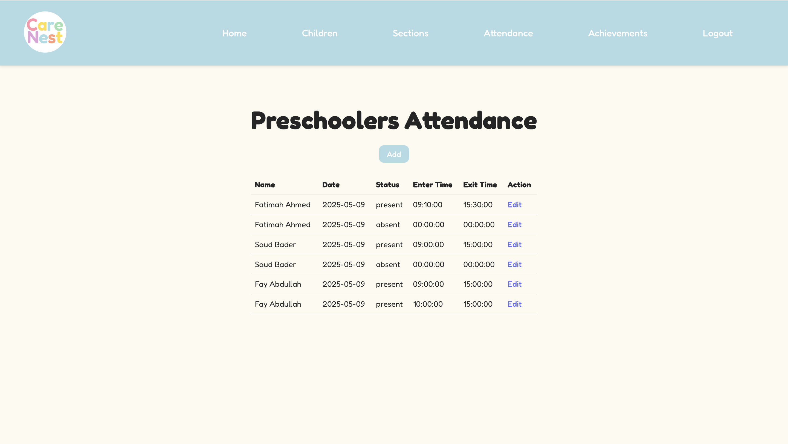
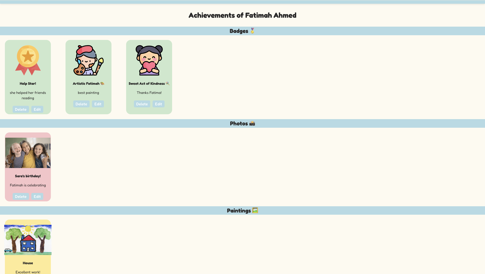
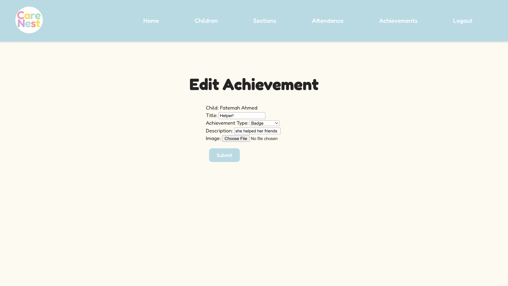
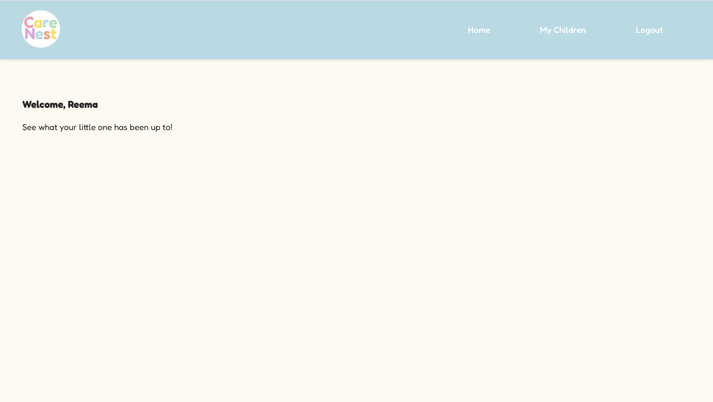
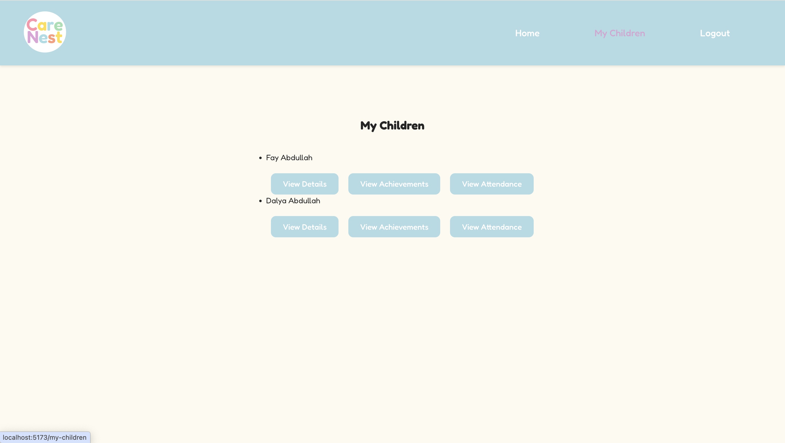

# CareNest Daycare

## Project Description

CareNest is a full-stack Daycare Management System that helps daycares manage their work easily. It supports two types of users: **Parent** and **Supervisor**.

* **Parents** can:

  * Track their own children attendance.
  * View their own children achievements.
  * Access their own children details.

* **Supervisors** can:

  * Add children and assign them to their parents accounts.
  * Track and manage all children.
  * Record daily attendance
  * Upload badges, personal images, and artwork

The system is built to make daycare management easier, more organized, and help everyone stay connected.

## Frontend Tech Stack

**Languages:**

* JavaScript
* HTML & CSS

**Frameworks & Libraries:**

* React.js
* React Router
* Axios

**Styling:**

* Custom CSS
* Google Fonts (Fredoka)

**Build Tools:**

* Vite

**Development Tools:**

* Git & GitHub
* VS Code

## Backend Repository Link

[CareNest Backend Repo](https://github.com/ghd1010/care-nest-backend)

## Getting Started / Code Installation

To set up the project locally, follow these steps:

### 1. Clone the Repository:

* **Frontend:** `git clone https://github.com/ghd1010/care-nest-frontend.git`

### 2. Frontend Setup:

```bash
cd care-nest-frontend-project
npm install
npm run dev
```


## App Screenshots
### Main Interfaces
#### Main Page

#### Signup Page

#### Login Page

### Supervisor Interfaces
#### Home Page

#### View CareNest Children Page

#### Child Detail Page

### Add Child Page

### Edit Child Page

#### View Sections Page

### View Section Attendance Page

### Add Attendance Page

#### Edit Attendance Page

### Selectin Section Attendance Page

### Achievements Page

### Add Achievements Page

### View Achievements Page

### Edit Achievements Page

### Parent Interfaces
#### Home Page

#### My Children Page

#### My Child Details Page

### View Attendance Page

### iew Achievements Page

## Frontend Routing Table
| **Route Name**                | **URL**                         | **HTTP Verb** | **Description**                              |
| ----------------------------- | ------------------------------- | ------------- | -------------------------------------------- |
| MainPage                    | /                             | GET           | Landing page (welcome + logo)                |
| HomePage                    | /home                         | GET           | Main dashboard/homepage after login          |
| Logout                      | /logout                       | GET           | Logs out the current user                    |
| AddChild                    | /add                          | POST           | Form to add a new child (supervisor only)    |
| ChildrenList                | /children                     | GET           | List of all children (supervisor only)       |
| ChildDetails                | /children/:id                 | GET           | Detailed view of a specific child            |
| EditChild                   | /children/:id/edit            | PATCH           | Edit form for a specific child               |
| AddAchievement              | /achievements/add             | POST           | Form to add a new achievement                |
| ChildAchievementList        | /children/:id/achievements/   | GET           | List of achievements for a specific child    |
| EditAchievement             | /achievements/:id/edit        | PATCH           | Edit a specific achievement                  |
| AllChildrenAchievementsList | /children-achievements/       | GET           | List of all achievements across all children |
| MyChildren                  | /my-children                  | GET           | View children linked to the logged-in parent |
| MyChildAttendance           | /children/:id/attendance      | GET           | View attendance of a specific child          |
| SectionsList                | /sections                     | GET           | List all sections                            |
| ViewSectionAttendance       | /sections/:id/attendance      | GET           | View attendance for a specific section       |
| ChildrenInSectionList       | /sections/:id/children/       | GET           | View children in a specific section          |
| AddAttendance               | /sections/:id/attendance/add/ | POST           | Add attendance record for a section          |
| EditAttendance              | /attendance/:id/edit/         | PATCH           | Edit a specific attendance record            |
| AttendanceDropDown          | /attendance                   | GET           | Choose section to view attendance            |
| Signup                      | /signup                       | POST           | User registration page                       |
| Login                       | /login                        | GET           | User login page                              |
| NotFound                    | *                             | GET           | Fallback for undefined routes (404 page)     |

## IceBox Features

1. Implementing a customized user type
2. Add staff (employees that the supervisor can track)
3. Add the `Post` model for communication between daycare and parents
4. Add the OTP code "Exit Code"
5. Add subscriptions and offers
6. Add food preferences for each child
7. Better UI/UX
8. Profile page for users
9. Parents should not Signup, because in real world, parent went first to the daycare, register their data there, and give them their acccounts. but I created the Sign up because its required to have a Sign up page.
10. Add a summary content in the home component for each user.
